# Report

[TOC]

## Abstract

A practical and robust onlie forum for programmer is of great great significance and necessity for CUHKSZ programmers. In this report, We present our design and implementation for the online forum database system. Starting from motivation, we continue to discuss the database structure, queries implementation. Database and GUI implentation will then be exhibited. Last, the data mining technique is utlized.

Index Terms—forum, database, E-R diagram, SQL, data mining, search engine

## Background & Introduction

​	Our group observe that many student-programmers from CUHKSZ may encounter many familiar programming questions in their project or assignment. Their solutions mainly include: searching online, emailing TAs or professors, uploading questions in WeChat group, or assigning an office hour. Searching online sometimes may not be an efficient way, because the blog or some guidance information may not directly answer the assignment question. Even worse, programmers need to spend much time on filtering the huge amount of information and it becomes hard for them to get answers when the homework question is not relevant to the results on website. Uploading questions on WeChat group could get the detailed guidance and answer. But the new WeChat group will be created every semester for other students who may encounter the same problems. The connection between students already taken this course with the students taking this course right now is broken in this way. Raising questions in office hour is not convenient for programmers to solve their question immediately since they need to make an appointment and wait until that day comes. Therefore, our group would like to take the first step to change the current situation, to provide a online Q&A platform with the support of online forum database.

​	==The main component of our project is the online forum database. There are two main entities in the database, namely "User" and "Blog". The "User" entity stores the account information about the user, including their name, email address, password, etc. The "Blog" entity is the key feature, where users can post a blog to raise a question and get relevant answers from other users. We also implement several relationship schemas to support the interaction between user and blog, like user can like a blog or follow a blog. To make our database more efficient and space-saving, we made efforts to do normalization on tables and introduce index in our project.==

​	Additionally, we built fantastic UI in the frontend and robust backend server to hide the detailed implementation and manipulation of the database. So users can focus on the Q&A procedure, and they don't need to worry about how to get the desired information from the database, as all the queries are carried out by the functions in the frontend and backend.

## Database Design

### The Entity-Relational Diagram

​	In our project, we have totally 7 entity sets and 5 relationship sets. The table gives an detailed interpretation of these sets.

| Entity / Relationship Sets Name | Description                                                  |
| ------------------------------- | ------------------------------------------------------------ |
| user                            | Stores the username, password, email, profile and etc. of the user's account |
| group                           | Stores the name, the description and etc. of the group       |
| sub_group                       | Stores the name of the group and the name of the sub group   |
| blog_questions                  | Stores the title, the author, the group type, the sub group type, the content and etc. of the blog |
| blog_answers                    | Stores the question id, the father answer id, the content and etc. of the answer |
| attached file                   | Stores the URL of the file, the question id, the answer id and etc. |
| attached picture                | Stores the URL of the picture, the question id, the answer id and etc. |
| user like answer                | Stores the user id and the answer id, which means the answer is liked by the user |
| user like question              | Stores the user id and the question id, which means the question is liked by the user |
| user follow question            | Stores the user id and the question id, which means the question is followed by the user |
| user follow group               | Stores the user id and the group name, which means the group is followed by the user |
| user view question              | Stores the user id, the question id and the viewing times    |

### The Relational Schemas

| Schemas                                                      |
| ------------------------------------------------------------ |
| user(<u>id</u>, email, username, password, photo, major, grade, create_time, update_time) |
| group(<u>id</u>, group_name, description, create_time, update_time, amount_of_follows) |
| sub_group(<u>id</u>, group_name, sub_group_name)             |
| blog_questions(<u>id</u>, title, author_id, group_type, sub_group_type, content, code, lang, content_format, like, follow, hot, create_time, update_time, views) |
| blog_answers(<u>id</u>, question_id, father_answer_id, content, code, lang, content_format, like, author_id, create_time) |
| attached_file(<u>id</u>, url, corresponding_question, corresponding_answer, create_time) |
| attached_picture(<u>id</u>, url, question, answer, group_name, create_time) |

**Below list the foreign key referencing:**

* "group_name" in sub_group refers to "group_name" in group: each sub group belongs to a group.
* "author_id" in blog_questions refers to "id" in user: each blog belongs to a user.
* "group_type" in blog_questions refers to "group_name" in group: each blog belongs to a group.
* "sub_group_type" in blog_questions refers to "sub_group_name" in sub_group: each blog belongs to a sub group.
* "question_id" in blog_answers refers to "id" in blog_questions: each answer belongs to a blog.
* "author_id" in blog_answers refers to "id" in user: each answer belongs to a user.
* "corresponding_question" in attached_file refers to "id" in blog_questions and "corresponding_answer" in attached_file refers to "id" in blog_answers: each file belongs to a question or an answer.
* "question" in attached_picture refers to "id" in blog_questions, "answer" in attached_picture refers to "id" in blog_answers" and group_name" in attached_picture refers to "group_name" in group: each picture belongs to a question, an answer or a group.

### Normalization

​	In our project, we spare a lot of effort on normalization. At first, we intend to reach the first normal form, so we reconstruct our database. For example, "Table 1" shows our initial design of the group table where has a tuple of sub group name. Therefore, we split the group table into group table (Table 2) and sub group table (Table 3). In this case, the first normal form is achieved.

| id   | group_name | sub_group_name                  | description     | create_time | update_time | amount_of_follows |
| ---- | ---------- | ------------------------------- | --------------- | ----------- | ----------- | ----------------- |
| 1    | CSC3170    | {Assignment1, Assignment2, ...} | Database System | 2022-04-30  | null        | 100               |

<b>Table 1</b>

| id   | group_name | description     | create_time | update_time | amount_of_follows |
| ---- | ---------- | --------------- | ----------- | ----------- | ----------------- |
| 1    | CSC3170    | Database System | 2022-04-30  | null        | 100               |

<b>Table 2</b>

| id   | group_name | sub_group_name |
| ---- | ---------- | -------------- |
| 1    | CSC3170    | Assignment1    |
| 2    | CSC3170    | Assignment2    |

<b>Table 3</b>

​	Based on the first normal form, we also try to reach the second and third normal form. As a result, we create an unique id for each table to enable all nonprime attributes are fully functionally dependent on the primary key (id). Apparently, there does not exist nonprime attributes in our tables transitively dependent on the primary key (id). Therefore, the second normal form and third normal form are also implemented.

## Query Design and Implementation

### DDL

As what we learned in class, we have to use data definition language to create new tables. As the graph, there are mainly two parts. In the first part, we set all the attributes and specify different types of the attributes based on the logical schema. The second part is about constraints. We have tried to specify all necessary integrity constraints including primary keys, foreign keys, keys that are not null or unique. Besides, we add necessary index constrains, which will be detailly inferred in the later part.

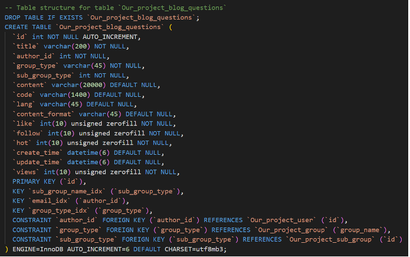

### Queries

We have used different ways to implemented the queried on the basis of the efficiency.

#### SQL

​	The easiest way to interact with the database is directly using the SQL language. This method is fast and with intime response. We prefer to use this way especially when we are testing our newly created tables. As the instance, we are testing the insertion operation on the like table. On top of that, we have tried to consider different concurrency issues in different cases. For this instance, we have locked and unlocked the table before and after we manipulate the table. Hence, the concurrency are protected.

#### SQL with host language

​	The problem about the SQL language is that it is not a Turing machine equivalent language. So it might be easy to access the data, but it is hard for us to efficiently analyze and process the data using direct SQL. Hence, we tried to solve it with host language Python, specifically, pymysql package. Together with host language, it is much easier to implement different operations. Therefore, lots of the database operations in the backend are carried in this way. The instances are followed.

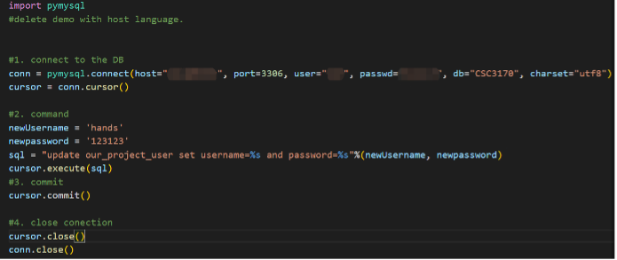

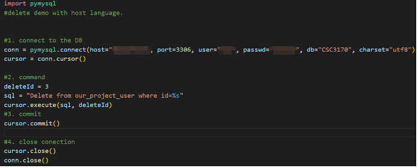

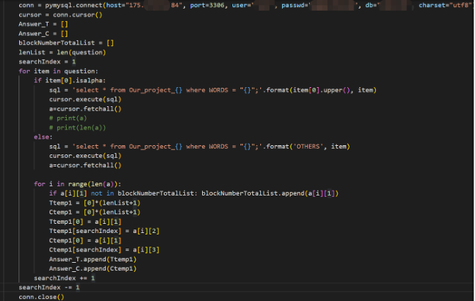

#### Query Set

​	Within the Django framework, there is another efficient way for us to manipulate the data which is the query set. The logic of query set is similar to SQL, but it is with a totally different gramma. Considering that in some cases it is actually more efficient for us to use the Query Set, we also implemented some data manipulation with the help of Query Set. The instance followed is about finding the titles of the blocks and upper them. 

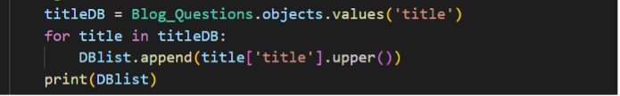

## Index and Hashing

To introduce index in our project to speed up some frequently use queries. We first search on internet to know some main kinds of indexes:

- T-Tree Index
- B-Tree Index
- Full Text Index
- Spatial Index
- Hash Index

After taking the structure of our database into consideration, we decided to focus on hash index and B-Tree index.

### 3.1 Hash Index

The main advantage of hash index is the fact that hashes can be much smaller than the indexed value itself.  And the query speed is relatively fast for exact lookups if there is not many conflicts.

But it also have disadvantages. The main problem, though, is that this index type can’t be used to do anything else than a simple lookup. So its usage is limited. What's worse, the hash index is only supported by "Memory" engine and the hashed index is all stored in the main memory, so the data is temporary and volatile. When the database restart or encounter some system issue, the data are all gone. But the require of our database is that, it stores all the questions and answers so users can easily solve their problems by simply searching the database. So the hash index does not satisfies the requirement of our project and was not adopted.

### 3.2 B-Tree Index

The B-Tree index is the most commonly used kind of index which speed up queries which match a full value. It use the B-Tree structure to store the index so the average searching time is reduce to log(h) (h is the height of the tree). Compared to the all table scanning of simply query without index, the improvement is extremely large.

To balance the tradeoff between space and query speed, we add index to some frequently queried columns in certain tables, e.g. the "username" column in "User" table:

(To better understand the importance of index, we use the "explain" syntax, the meaning of some key words are listed below:

- type: information about join type:
  - ref: multiple rows can be accessed for a given value so we are using standard, non-unique index to retrieve them.
  - ALL: full table scan.
- possible_keys & key: indexes which could be used for the particular query and the index chosen by the optimizer as the most efficient one.
- rows: an estimate of how may rows the query will scan.
- Extra: prints additional information relevant to how the query is going to be executed. )

    

        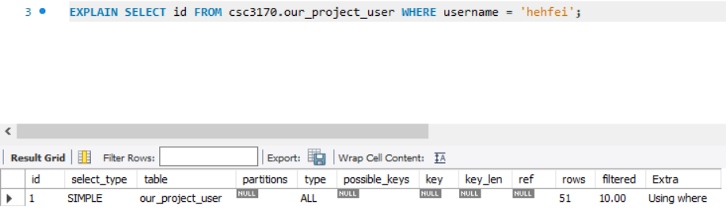
    

      Before introducing index

Before we add index to the table, when we want to get the id of a user with specific name, the whole table is scanned, and around 51 rows is scanned. (if the table grows larger, this number will also grow), so the speed is very slow.

    

        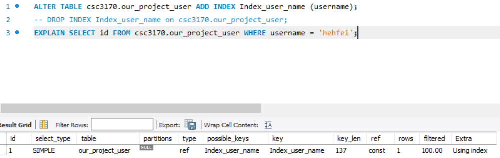
          After introducing index
    

But after we introduce the B-Tree index, the query will take advantage of the index, and the number of rows to be scanned it greatly reduced.

##  Database System Implementation

### Database Instrance Deployment

​	For the convience of database management among group members, instead of building up the database system on one team member's personal computer, we choose to purchase a remote cloud server and configure the mysql database for project usage. 

​	We purchase a Tencent Cloud Server, whcih is deployed in Guangzhou using MySQL 8.0 version. The configuration of the database is one CPU core with 1000MB memory and 25GB storage.

​	Database can be connected via MySql workbench with the below information.

​	The database implementation is based on mysql and python, as introduced above. The frontend webpage deisgn is based on Vue frameworkd. Also, we use nigix to mount and agent our webserver, which provide a domain name http://www.cuhksz-stackoverflow.cn/. It is more convenient for normal user to register and check our webpage without building the program in their local computers. 

### Data generation

To better test the function of the database, our group also populated our database with an abundant amount of real data. As the question blogs in forum is the major data information, we collect those data from two different method. One is from the developer perspective, the other is from the  real user perspective. 

For the developer, our group member collect the data from many source. We collect the questions from wechat group, other forums, and websites and write them into blog. The work is time consuming since we need to write and generate the data all by hand. And we also run a simple web crawl to get some question blog from the website stack-overflow, and use those information to generate a blog automatically. 

To make our database more relevant and friendy to real user, we also collect the information from other user. Before we build the completed program, we let some user register the web account and post their questions that encountered recently. Those users will generate data that is more specific to their course project which is meet the requirment of our goal of this forum. 

### Graphic User Interface Design

In this part, the graphic User Interface of online forum will be introduced. As mentioned, the system is implemented based on Vue framwork which provide embedded html, css and javascript. Since this framwork is suitable for building a quick and agile website, the style of the system is simple and clear. The main color style of our webpage is baby blue with many corlorful button embedded. The whole frontend is pretty user-friend and wisely organized. there are 5 modules totally in our system. Here is the briefly introduction of those basic components with screenshots. 

1. Login & Register

This module is used for collect the user information and store the information in database server. Also, when user login to our webpage, the query of retrieve the corresponding user name and password to match the input of user will be triggered. Hence, based on this module, the user will be required to do the authentication with his own username.

2. User Home

This module is the main page for user to execute serval operations on our webpage. The webpage will show the catalog for user to see the servel blogs. For instance, there are 5 catalog contains "hot blogs", "my blogs", "unsolved blogs" and so on. Those catalof show different orders of all blogs in our database. This page also include many buttons for user to jump to anthor operations. 

3. Post Blog

This module is used for user to write their blog content. The users are required to type the blog title and content, partition and their subpartitions in order to classify. The content input will be finished in a rich editor. The rich editor support many forms of input and file uploading. Users could upload their file or just insert a file link. Our server will receive this file and store it on the server. Users could use the rich editor to create the blog forms they prefer. And all the blogs on the home page will be decoded as the same as they posted on this webpage. users are also allowed to write their code as a supplement material. 

Users could also run the code to see the output. Typically, Users are allowed to write the code without environmental configuration. They could also write code on an iPad or a phone. The online compiler support many languages, including C, C++, Python, Rust… The running time and memory used will be shown on the webpage just as an open Jude system. The code will be highlighted due to different language, different language has a different highlighted method, and they will also be used here to improve user coding feeling. 

4. Blog page

This module is used for show the content of each blog. When users go into the blog page, they could see the blog’s partition and its subpartition and click the like or follwed button to support this blog. The user are allowed to reply poster on the bottom of this blog, which provie a efficient way to communicate and solve the problem stated in blog.

The users are allowed to delete their own blog, which will trigger the query to delete the blog. The user only have the access to delete their own blog. They can not delte the blog that is not posted by them. 

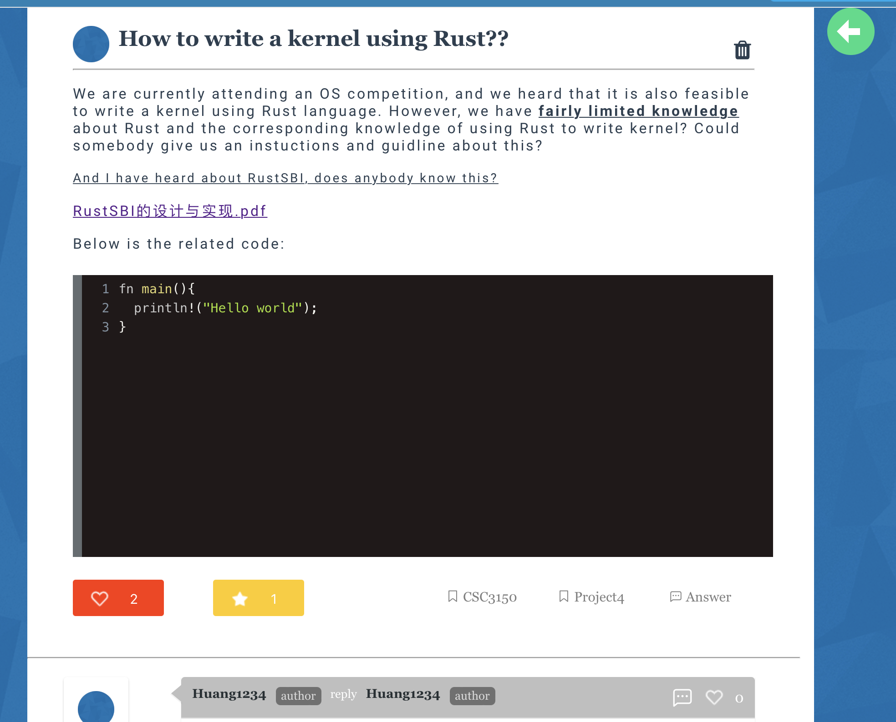

5. Searching

In this module, user are allowed to search the relevant blogs by typing the keyword. The detailed implementation will be introduced with the graphic result in the data mining part.

## Data Mining

### Motivation and target

​	Originally, for the blog searching function, we simply appy String match method which simply divide the sentence into pieces of words without any special tokenize, and then search every word separately to match all the blogs in our database to dertermin whether they are relvevant. This methods is practical when the question string is small and the database is relatively small at the same time, since the complexity for this design is O(M * N), where M represent the number of words in user's searching sentence, and N represent all of the words in forum database. The performance becomes worse when the database grow, which means more user post their blog on our forum. This search method will search every word in a equal status and do not identify the key word in the search sentence, which makes it search every word in the same procedure repeatly in the database. Each search operation will iterate all of the data blocks that store the information of blog, which  generate a huge IO time and significantly reduce the search efficiency.

​	Due to this limitation, our group decide to create a search engine that could reduce the IO overhead and improve the searching speed. The Searching engine mainly can implement the following functions:

1) Identify the key word in the search sentence and also regonize the patterns in a sentence. The search engine are able to identify the key word and filter stop word to reduce the useless searching procedure. It only use the useful key word to map the corresponding result in database.
2) Search engine should create and matain a data structure to replace the string match method, which take advantage in insertion but have drawback in searching. The Search engine should find the corresponding record in data block in a short time.
3) The Search engine should maintain a order algorithm, which should sort all of the blogs that have been classified into relevant. The search engine should compare the similarity between the original searching question with all of records has been found, and finally return those blogs in a sorted way to user interface. 

### Method

​	To design such an engine, we need to tokenize the key word in a sentence and construct a special data structure in order to mantain a short search runtime. So we divide this procedure into 3 parts via below procedure:

1) **Tokenize the key word in a search sentence.** In this procedure, The search engine will use Natual Processin Language method to traninig a model which can identify the stop word to filter. For instance, the search engine is responsible to filter the meaning less word such as "my", "the", "an", as which do not play a role in the searching process. This procedure will aslo count the key word occurance times. The more occurance times in a word, the more weight it will have in the searching process. Based on the weight, the search engine is able to compare the similarity of search questions and the blogs in database. More importantly, The search engine should transfer different tense word into the same. Since the search engine identify the word based on its meaning, the word have different tense should be treated equally. For instance, the word "make" is equal to word "made", and the word "built" should be treated as "build".
2) **Contruct an inverted index table for seaching.** Originally, the searching method is to match every word with all data content in database, which is inefficient since it need compare each pair of word even if they are not relevant. This method is good for  insertion but not friendly for searching. In our way, the search engine will construct a inverted index table which is a two level index. The first index is table that store the alpha letter from A to Z, which represent the first letter of a word. The search engine will identify the the first letter of the keyword and find the corresponding pointer in first index table which point to the  second index table. In The second index table, it store all the words that have occurred in past blogs that have the same first letter. For example, the first second index table store all the words that have occurred in past blogs, such as "abondon", "abort" and so on. Notice that those words are required to be meaningful, the word like "a", "an" will not be shown in this table, which could speed up the searching process. Hence, in this way, every time when user post a blog, the search engine should spend the extra overhead to spilt and filter the blog content then update both the first index and second index table. Similarly, after user delete its own blog, search engine should update and maintain the index table at the same time. Based on the two index table, the key word will find the corresponding blog containg this word directly instead of scaning through the whole database. In this design, It takes time in insertion and deletion but efficient in searching runtime. Based on the tradeoff, we choose to implement this search engine, below is the demonstrative figure:

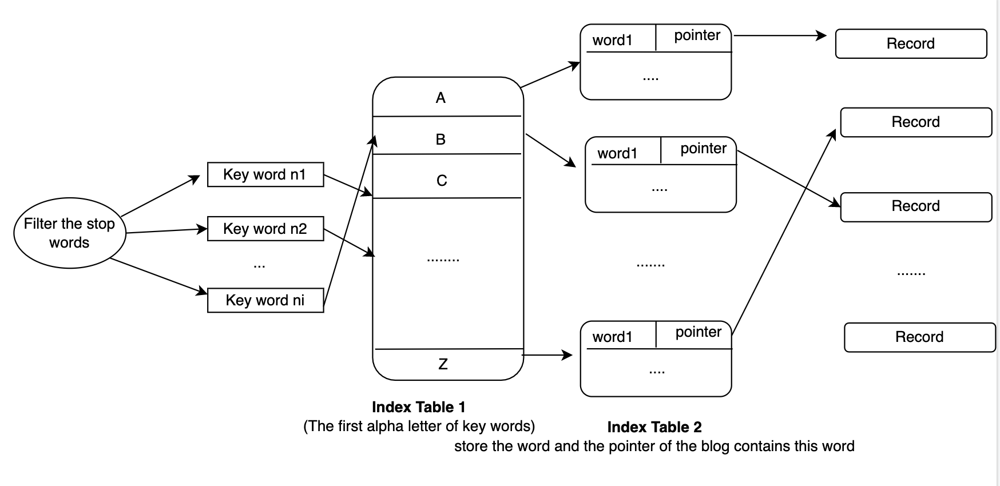

3. **Compare the similarity between the question and corresponding result in database.** After we retrive the corresponding result in database, we need to sort those blogs based on the similarity. The search engine is responsible to design a algorithm that could sort those blogs in an order. In our design, we reference the TF-IDF method, which construct the words into vectors and use projection to compare the similarity. Our search engine will create a word vector for the searching question and those corresponding blog, and do the projection pairly to sort those result blog based on projection value. Notice that the vector creation process will consider the word weight. The word that occur in searching sentence for many times should have the high priority than those words occur less. The word occur in title should have the higher priority than those occur in content. The search engine should also take care of it when doing the vector creation and projection. Below is the demonstrative figure:

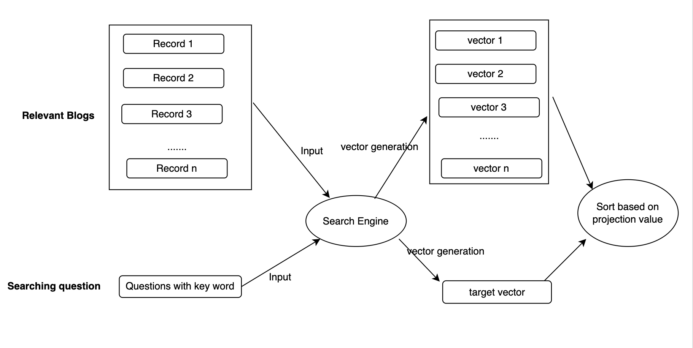

### Outcome Anaysis

​	Based on the search engine design, the experiment mainly test three parts. The first part is the tokenize of the search engine. It test whether the search engine could transfer the tense, filter the stop words. The second parr is going to test the performance of the searching process, which is to examine its searching speed and use precision-recall method to examine its precision. The third part is to test the similarity sortion, which aim to exmain the sortion algorithm accuracy.

1. **Tokenize Test** 

We use two demonstraive test case here to report the tokenize result. The first case is for the tense identification. The word has the same meaning but with diffrent tense should be treat as the same. It means that when user search the question with one  tense, the word has the same meaning with all of the tense should be retrived. For instance, here we search the word "build", the blog contain either "built" or "build" should be retrived. Below is the demonstrative figure:

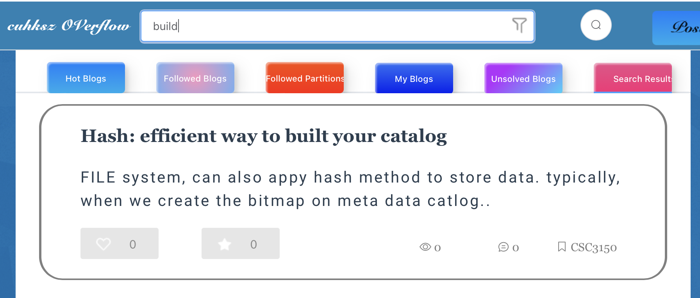

The second test case is for stop words filtration. The word that has no useful meaning should be ignored when searching. The stop words contain "my", "he", "the", "a", and so on. We create a stop words list, so every word in searching should be identify whether it is a stop word when searching. If the word is be classified as the stop word, the search engine should terminate the following retrive part and return "no result found" to User Interface. Here comes the demonstrative figure:

The third test case is for case insensitive test. The search engine should retrive the word in a case insensitive way, which means the words in upper letter or in lower letter won't change the retrival result. Here comes the example when we search word "file", and the upper case "FILE" will be retrieved at the search runtime. 

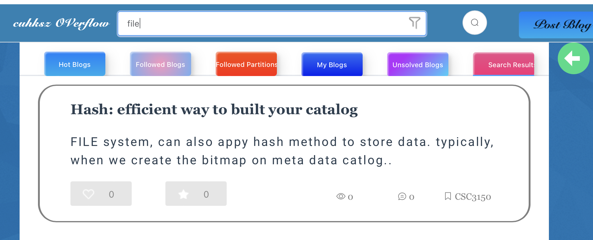

2. **Searching speed and accuracy evaluation**

Based on the design, we could drive the searching complexity is around O(1) for each word, since each word have the index directly interact with the record block. Hence the whole retrival speed is O(N), where N represent the number of key word in the search sentence, which is significantly less the the original one O(M*N). where M represent the number of words in database, which is a giant number. More importantly, The IO overhead will reduce significantly in seaching runtime, Because the search engine only need to execute one IO operation (read) after find the blog by index. Instead, The original one will execute more IO operations since it need to read all of the blogs located in data record. The performance of the searching speed will be improved dramatically. ==(**remaining a TABLE)**==

For the accuray evaluation, Our searching engine typically will retrive all of the documents that contains the keyword. Assuming that in our database design the blog is relevant if and only if the the document contains the key word in the searching questions. This design is not robust enough since there is a possibility that the documents do not contain any key word but still relevant to the searching question. However, for the data in our database, this assumption is practical enough. In this way, since all the blog containing the key word will be retrived, the search engine could achive a high recall rate (the documents retrieved that are relevant in database/ allthe documents that retrieved). However, this method sacrafice the precision rate. There is a limitation for our design which is the searching engine only support OR operations for the key word searching.  Basically, each key word will be connected in an OR logical operations. The search engine does not support AND or XOR operations to narrow down the search filed. Hence, the precision rate will shrink in this design.

To cover the problem stated above, we design another filter to narrow down searching filed hence improve the searching precision. User are allowed to chose the partition and subpartition that they wan to narrow down. Based on this filter, only the blogs that exactly in this partition will be retrived. Hence search engine are able to narrow down the searching scope in order to increase the precision rate. Below is the demonstrative figure:

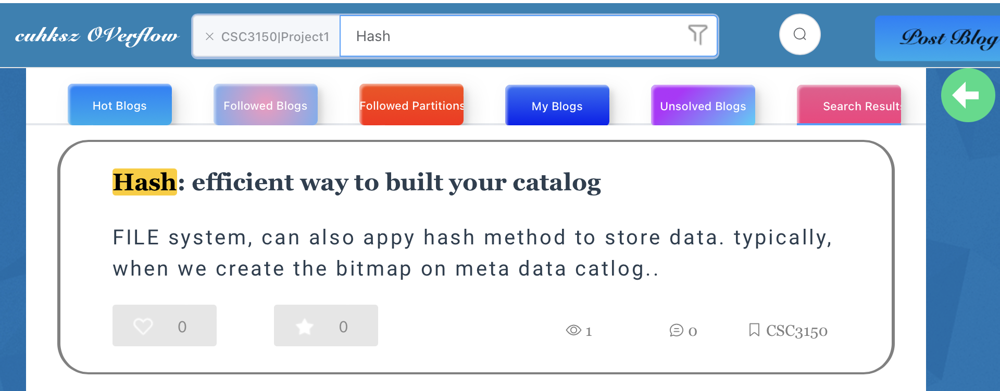

3. **Similarity Sortion Algorithm**

As we stated above, the search engine use OR logical operations in each key word retrival. Hence we need to similarity algorithm to sort those results. In the test case, The first searching word is "tree", then the engine will retrive all the blogs that contians the word "tree".  The most relevant one is the blog that contains most number of "tree".

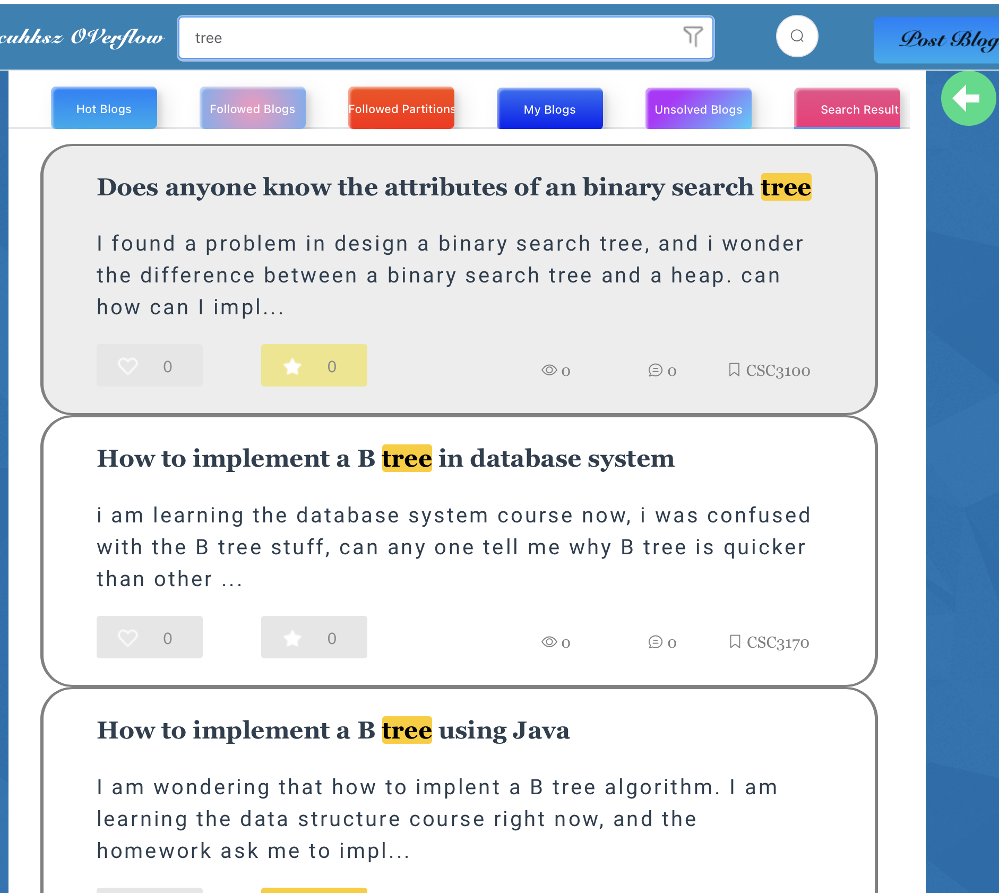

The second test case is "B tree", which will retrive all blogs contain "B" or "tree". But the most relevant one is the blog contains both "B" and "tree", which shows the high similarity. 

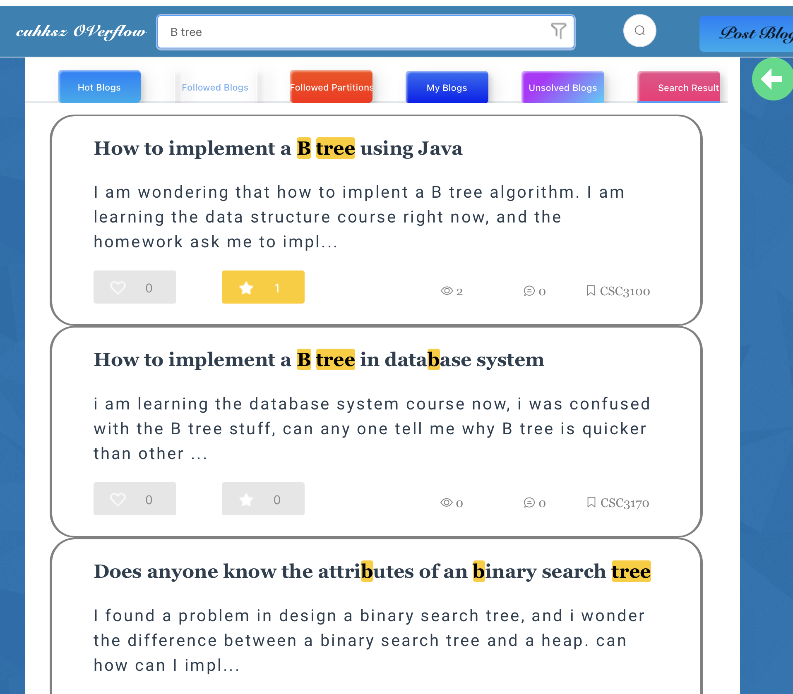

The third test case is "B tree database", which will retrieve the blogs contain either of three words.  But the most relevant one is the one which contains all of the three words, as the figure shown, the order of blog is changed.

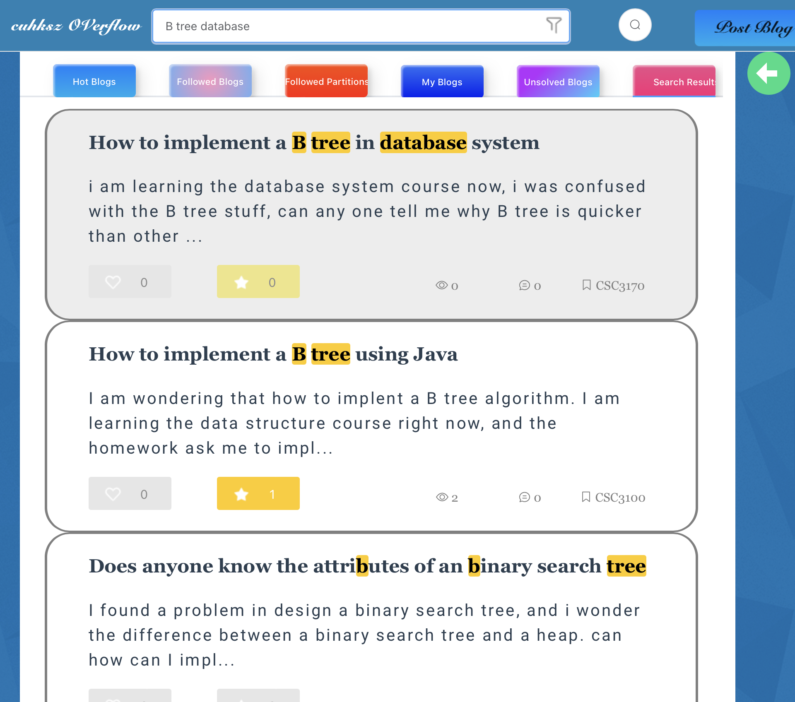

## Application

## Conclusion

In Conclusion, our project is about implementation, optimization, and analysis of a on line forum database.

​    For the E-R diagram and database design, we optimize all tables into 3NF form to avoid the redundancy as much as we could. For queries, we use different ways including direct SQL, SQL with Python, and Query Set to access and manipulate different data in an efficient way. For the index optimization, we designed a B tree searching method to increase our query speed in order to provide user a faster and fluence searching experience. We also designed and implemented a nice user interface for users. For the datamining, we designed and implemented an effective search engine with machine learning NLP and inverted index tables.

## Self Evaluation

